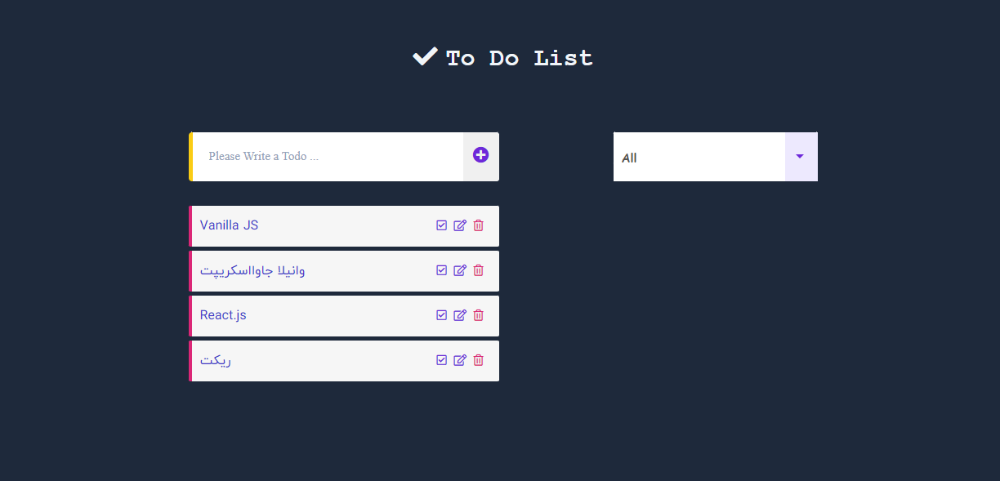

# Todo List Project 🗒

## [App Online Link](https://todo-list-oop-app.netlify.app/)

## App Demo

---

## Description

Todo List is a Simple Web Application to Save Your Daily Tasks in order not to Miss Anything;

In this Project, you can Create the Desired Task, and if you Finish it, make your Task Checked, and if you cancel, return it to the Previous State; Delete or Edit it;

On the other hand, you can Filter your Tasks and Manage your Personal or Business Plan by the Relevant Drop-Down List.

This Modular Web App is Developed in Object-Oriented Programming Style (OOP)

## Features

- Edit Task
- Check Task as Completed or Uncompleted
- Delete Task
- Save Tasks in Local Storage
- Cannot Insert Empty Task
- Cannot Insert Duplicate Task (Even When Editing the Task)
- Checked Tasks Remain in Check Mode When the App is Up.

## Tips 📌

- fully responsive for mobile, tablet, laptop and desktop

## Web Development Technologies

- HTML5 (Semantic HTML)
- Pure CSS3 (FlexBox)
- Vanilla JavaScript

## Contact Me 📧

  

